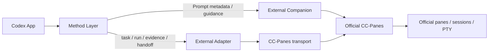

# Method Layer

> **Codex App ↔ CC-Panes 的外部方法层与兼容协议**
>
> 把任务意图、运行绑定、验证证据和主控交接变成可审阅、可验证、可迁移的本地 artifact。

本仓库面向使用 **Codex App** 和 **CC-Panes** 的开发者、Agent 工程维护者与工具集成者。它不复制 CC-Panes 的 UI、Orchestrator 或运行时，而是在外部提供一层稳定的方法协议、schema、Prompt Pack、适配器和验证工具。

## 为什么需要 Method Layer

AI 编码工具可以启动任务、调用 worker、修改文件，但跨工具协作时仍需要回答几个工程问题：

- 这次任务到底要完成什么，哪些动作被明确授权？
- 当前运行绑定到哪个 workspace、worktree、session 和 profile？
- “完成”是否有可复核的检查结果，而不只是模型的一句总结？
- 中断、重试、交接或切换工具后，如何保留事实、证据和恢复路径？

Method Layer 将这些信息固定为机器可验证的契约，让 Codex App 可以通过外部方法层兼容 CC-Panes，而不要求方法层侵入宿主工具。

## 核心能力

- **结构化任务契约**：明确目标、基线、授权、验收、证据要求、停止条件和 lineage。
- **可验证运行绑定**：记录 task、runner、session、profile、workspace、worktree 和 launch-time contract。
- **证据驱动完成**：将检查结果、文件触达、drift check、Git 状态和残余风险写入 artifact。
- **九段式主控交接**：让下一位 Agent 能从事实和证据继续工作，而不是依赖上下文猜测。
- **外部 Companion**：通过旁路指导兼容官方 `cc-panes.exe`，保留双方运行时边界。
- **File-first Adapter**：用依赖零安装的 PowerShell 7 reference adapter 连接方法 artifact 与 CC-Panes transport。
- **可审计 Controller**：先生成 MCP request plan，再按 dry-run、journal、hash precondition 和 recovery 规则执行。
- **Prompt Pack**：将阶段、变更类型、风险和技术栈相关的 Prompt 元数据、输出合同与 eval 固定下来。

## 兼容关系



职责边界很简单：

| 层 | 负责什么 |
| --- | --- |
| Codex App | Agent 对话、任务推进和人工决策 |
| Method Layer | 方法协议、schema、Prompt 元数据、证据与交接 |
| Adapter / Controller | 将方法 artifact 映射为可审阅的 transport request |
| CC-Panes | 官方 panes、sessions、PTY 和既有运行时 |
| 目标项目 | 代码、项目事实、授权上下文和最终业务验收 |

## 60 秒开始

仓库不需要额外依赖。推荐先运行完整冻结验证：

```powershell
pwsh -NoProfile -ExecutionPolicy Bypass -File scripts\validate.ps1 -Mode Full
```

只想快速确认结构、schema、examples、Prompt Pack 和 Companion：

```powershell
pwsh -NoProfile -ExecutionPolicy Bypass -File scripts\validate.ps1 -Mode Fast
```

生成一份 External Companion guidance：

```powershell
pwsh -NoProfile -ExecutionPolicy Bypass -File scripts\companion\new-guidance.ps1 `
  -ContextPath tests\companion\fixtures\design-request.json
```

输出是一个 JSON 文档，其中包含：

- 选择的 Prompt IDs 和版本；
- 所需的项目事实；
- 输出合同与人工复制步骤；
- 缺失输入或授权缺口；
- 官方目标的 mutation flags。

默认目标声明保持为：

```json
{
  "launchesOfficialExe": false,
  "writesOfficialConfig": false,
  "mutatesHost": false
}
```

## v0.1 方法协议

v0.1 定义四类 public JSON artifact：

| Artifact | 作用 | Schema |
| --- | --- | --- |
| `task` | 目标、授权、基线、验收、证据要求、停止条件和 lineage | [`schemas/task.schema.json`](schemas/task.schema.json) |
| `run` | task 引用、runner/session/profile、workspace/worktree 和 launch-time contract snapshot | [`schemas/run.schema.json`](schemas/run.schema.json) |
| `evidence` | outcome、文件触达、检查结果、drift check、Git 状态和残余风险 | [`schemas/evidence.schema.json`](schemas/evidence.schema.json) |
| `handoff` | 结构化九段式主控交接 | [`schemas/handoff.schema.json`](schemas/handoff.schema.json) |

所有 v0.1 artifact 都必须包含：

- `protocolVersion: "0.1"`；
- 与 schema 对应的 `artifactType`；
- 统一规则的 `taskId`；
- 关键字段非空约束；
- 明确的 `additionalProperties: false` 对象边界。

`riskMode` 只有 `simple`、`standard`、`deep` 三种建议性工作深度。它不授予权限，也不自动选择 profile、启动 worker 或驱动 finish 行为。

## 组件

### External Companion

官方 `cc-panes.exe` 原样运行。本仓库只提供旁路方法层指导：

1. 调用方提供 `official-ccpanes-companion-request` JSON；
2. Companion 读取本仓库 Prompt Pack metadata；
3. 根据任务阶段、变更类型、风险标签和项目事实确定 Prompt IDs；
4. 输出 `official-ccpanes-companion-guidance` JSON；
5. 由人工或已批准的 transport surface 继续执行。

Companion 不启动官方 executable，不写官方配置，不改 host，不注册 profile、hook、plugin 或 MCP，不执行或组合 Prompt，也不持久化 Prompt 正文。

### Prompt Packs

Prompt Pack 是方法层的内部配置和知识输入，不是第五类 public artifact。当前首个 pack 是：

```text
prompt-packs/java-enterprise/pack.json
```

它包含五个本地化 Prompt、一个 Java/Spring 技术栈 profile、十三个确定性 eval fixtures，以及锁定 donor 的窗口哈希。具体框架版本必须来自项目事实；Prompt Pack 不扩大 task authorization。

Focused validation：

```powershell
pwsh -NoProfile -ExecutionPolicy Bypass -File tests\prompt-pack\run.ps1
pwsh -NoProfile -ExecutionPolicy Bypass -File tests\companion\run.ps1
```

### File-first Adapter

reference adapter 用 PowerShell 7 和本地文件消费 v0.1：

```text
prepare-launch
  -> transport invokes launch_task
  -> bind-launch
  -> resolve TaskBinding by sessionId
  -> apply taskBinding metadata patch

finish-run
  -> publish evidence
  -> update run
  -> emit leader report when required
```

常用命令：

```powershell
pwsh -NoProfile -File scripts\adapter\prepare-launch.ps1 `
  -TaskPath PATH_TO_TASK `
  -CliTool codex `
  -Profile PROFILE_ID `
  -RuntimeKind local

pwsh -NoProfile -File scripts\adapter\bind-launch.ps1 `
  -AttemptPath PATH_TO_ATTEMPT `
  -LaunchResponsePath PATH_TO_RESPONSE

pwsh -NoProfile -File scripts\adapter\finish-run.ps1 `
  -RunPath PATH_TO_RUN `
  -TaskBindingPath PATH_TO_BINDING `
  -EvidencePath PATH_TO_EVIDENCE
```

完整命令和恢复流程见 [`adapter/README.md`](adapter/README.md)。

### Controller Planner 与 Executor

`plan-transport.ps1` 消费 adapter envelope、TaskBinding snapshot 和 recovery journal，输出 schema-valid MCP request plan：

- `launch_task`；
- `find_task_binding_by_session`；
- `update_task_binding`；
- 条件性 `report_to_leader`。

`execute-transport.ps1` 对 plan 做第二次 schema 校验，并提供：

- 默认 `dry-run`；
- 显式 `live` MCP Streamable HTTP transport；
- append-only JSONL journal 和独立 response artifacts；
- TaskBinding snapshot hash precondition；
- read/update 最多三次 transient retry；
- 歧义 launch/report 单次后进入 `manual-review`；
- crash/replay 时跳过 request hash 相同的成功 mutation。

完整说明见 [`controller/README.md`](controller/README.md) 和 [`docs/ccpanes-mcp-transport-runbook.md`](docs/ccpanes-mcp-transport-runbook.md)。

## 验证与质量门

从仓库根目录执行：

```powershell
git status --short

python -m json.tool schemas\task.schema.json > $null
python -m json.tool schemas\run.schema.json > $null
python -m json.tool schemas\evidence.schema.json > $null
python -m json.tool schemas\handoff.schema.json > $null

pwsh -NoProfile -ExecutionPolicy Bypass -File scripts\validate.ps1 -Mode Full
git diff --check
```

`Full` 覆盖：

- schema、examples、templates；
- PowerShell parser；
- Prompt Pack；
- Official Companion；
- adapter、controller planner、controller executor；
- public examples 的正反校验；
- source-locked artifact 的精确 bytes 与 SHA-256；
- `tests\.tmp` 清理断言。

成功条件包括：

- `examples/valid/*.json` 通过对应 schema；
- `examples/invalid/*.json` 被对应 schema 拒绝；
- adapter、planner、executor、Prompt Pack 和 Companion 测试通过；
- 每个 required evidence 都有同名且 `status: pass` 的检查；
- public v0.1 schema 和 artifact 语义保持不变；
- 没有未解释的越界变更。

## PaneForge 只读审查 seam

Prompt Pack 可以通过下游 PaneForge 预览实现进行只读审查。方法层继续维护 Prompt、schema、profile、eval 和来源哈希；审查端只接收调用方提供的 source-lock JSON 与 sanitized catalog JSON。

它可以核对：

- source-lock 原始 UTF-8 bytes；
- manifest、profile、eval 和 Prompt 哈希；
- Prompt 身份、顺序与覆盖范围；
- 本机路径、`file://`、Prompt 正文、donor 文本和未批准 authority 等脏输入。

一致时展示 metadata；哈希不一致时隔离为 `quarantined`。该 seam 不执行或组合 Prompt，不生成或安装 Skill，不写方法层，也不修改宿主配置。

## 项目边界

本仓库专注于方法层协议、schema、模板、映射文档和本地实验脚本：

- 不把 Lattice 或 Aegis 的完整成品复制进来；
- 不接入 CC-Panes 主仓库或修改官方 source tree；
- 不实现 UI、hook、plugin、profile 或 MCP 写入；
- 不写用户全局配置；
- 不自动 merge、push、cleanup 或执行其它远端操作；
- 不把 GitHub 设为唯一事实源。

上游能力吸收必须记录来源、版本或 commit、采用理由、改写点和舍弃点，并保留本仓库的 artifact 边界与授权模型。

## 文档导航

推荐阅读顺序：

1. [`HANDOFF.md`](HANDOFF.md)：当前权威基线、授权和下一步；
2. [`docs/charter.md`](docs/charter.md)：方法层定位与非目标；
3. [`docs/architecture/repository-structure.md`](docs/architecture/repository-structure.md)：目录职责和维护检查表；
4. [`docs/integration-map.md`](docs/integration-map.md)：上游概念、v0.1 字段和 future 边界；
5. [`companion/README.md`](companion/README.md)：External Companion 边界和命令；
6. [`adapter/README.md`](adapter/README.md)：File-first Adapter 命令；
7. [`controller/README.md`](controller/README.md)：规划、执行、journal 和 recovery；
8. [`examples/README.md`](examples/README.md)：正反实例；
9. [`schemas/`](schemas)：机器可验证契约；
10. [`templates/`](templates)：任务和交接模板。

## 当前状态

- Protocol baseline：v0.1；
- 当前仓库分支：`codex/official-ccpanes-companion`；
- 当前本地工作区：`D:\ccpanes-method-layer`；
- 项目主页（用户提供）：[lihuabin1516-design/method-layer](https://github.com/lihuabin1516-design/method-layer)；
- 当前实现重点：外部 Companion、Prompt Pack、File-first Adapter 和 Controller transport seam；
- 官方 CC-Panes runtime integration 仍保持独立边界，需单独定义目标面和授权。

## License

License information will be added when the repository license decision is finalized.
